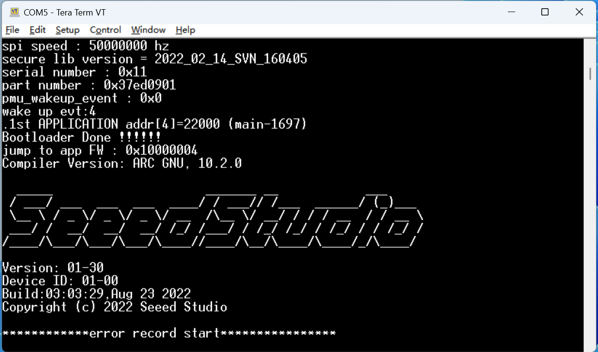
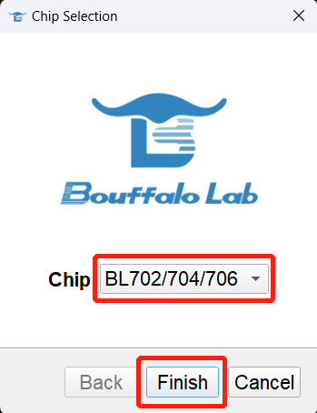
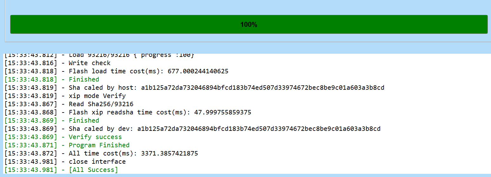
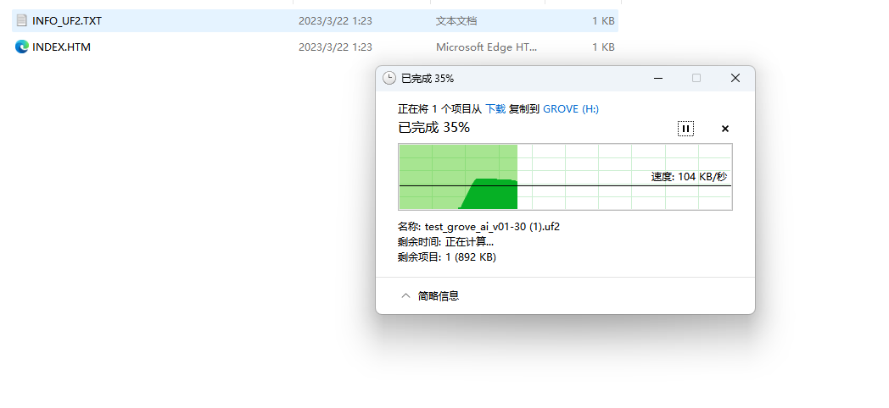
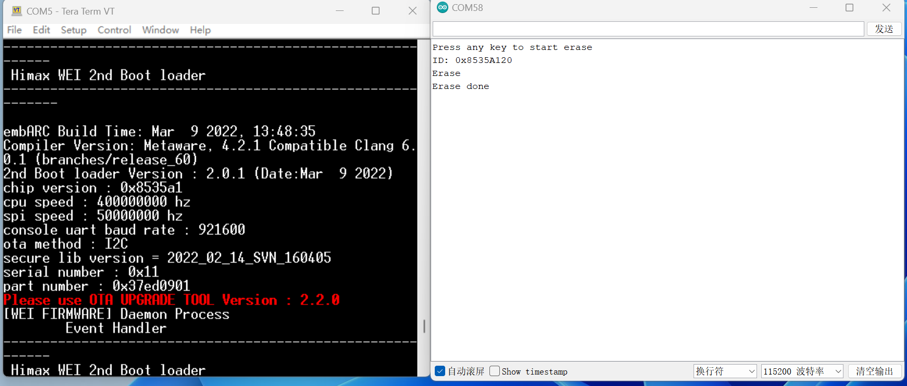

## FAQs
### 1. How to get the latest firmware
The latest Bootloader, firmware and some model files can be obtained from the following connection
[https://github.com/Seeed-Studio/Seeed_Arduino_GroveAI/releases](https://github.com/Seeed-Studio/Seeed_Arduino_GroveAI/releases)
### 2. baud rate of the serial port of the device
```info
921600
```

### 3. Update Bootloader
> BL702 as a secondary chip implements the function of upgrading firmware, burning model, serial port forwarding, it is highly recommended to upgrade to the latest version for a more stable experience, if your device's Bootloader is already the latest version, there is no need to upgrade.

- View version information
   - Double click the `BOOT` button and wait for the removable drive to mount
   - Open INFO_UF2.TXT in the removable drive


The version in the example is v2.0.0 

- Download and install the BLDevCube software
   - Open [https://dev.bouffalolab.com/download](https://dev.bouffalolab.com/download)


- Follow these steps to enter the burn screen
   - Open the previously installed `Bouffalo Lab Dev Cube`, select `BL702/704/706`, click `Finish` to finish the selection



   - Select `MCU` tab, open `Browse` in `Image File` and select firmware


- Press and hold the `Boot` button while connecting the device via Type-C


- Refresh the device and select the corresponding serial port, click `Create & Download` to start burning the firmware


- When you succeed, you can see the following message
- 
### 4. Update the firmware

- Connect PC with Grove Vision AI using Type-C
- Double click the `Boot` button on the `Grove Vision AI` to access the `Bootloader`.


- A removable storage media named `GROVE` appears on the PC


- Copy the corresponding .UF2 firmware to this removable storage media



- Wait for the copy to complete and `Grove Vision AI` to reboot
### 5. Burning the model
Same way as updating firmware
### 6. Unable to boot
Sometimes burning the wrong firmware will cause the device to fail to boot up properly, which is manifested in the form of opening the corresponding serial port after connecting to the PC via USB, and then pressing the reset button to find no data printing on the serial port. The board that boots normally will have a boot log. The repair method is as follows
- output the log of the device that boots normally

- did not output the log of the device that failed to boot


- Connecting the device to the Arduion board via I2C

Here we recommend using Seeeduino XIAO series, or Wio Terminal

- Connect both the `Vision AI` device and the `Arduino device` to the PC
- Open the serial port of `Vision AI`.
- Burn the repair program to the Arduino board and open the serial port of the Arduino board

   [https://github.com/Seeed-Studio/Seeed_Arduino_GroveAI/tree/master/examples/erase](https://github.com/Seeed-Studio/Seeed_Arduino_GroveAI/tree/master/examples/erase)
   
The following message appears to indicate that the repair program is running successfully


- By updating the correct firmware it will boot properly